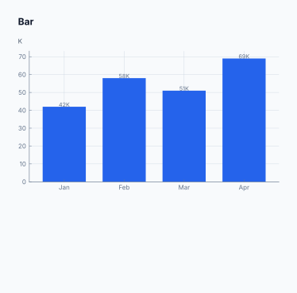
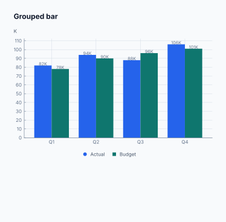
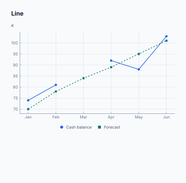
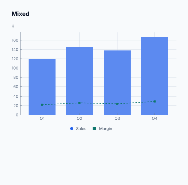
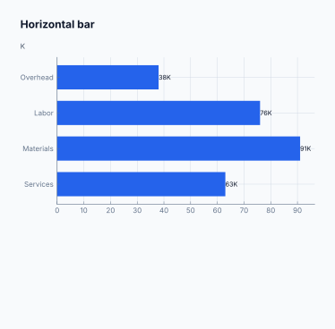
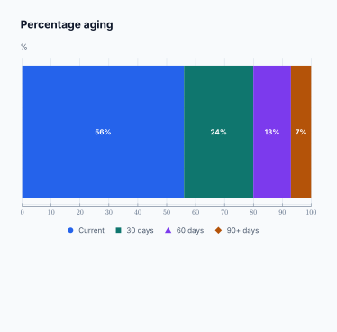
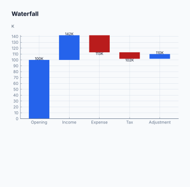

# Report Charts

Crispy Print renders supported report charts natively in Typst with
[Lilaq](https://lilaq.org/). The renderer is vendored with the application,
version-pinned, and available offline. Frappe's browser-rendered chart SVG is
not a competing chart engine: it is used only as a sanitized compatibility
fallback when a chart cannot be represented by the native contract.

## Rendering architecture

The normal rendering path is:

1. ERPNext or Frappe returns the report's chart data.
2. Crispy Print normalizes that data into a stable, printable `chart_spec`.
3. A supported, ready specification is assigned `engine: "lilaq"`.
4. Typst imports `@local/crispy-charts:0.1.1`.
5. That package renders the chart through the vendored Lilaq 0.6.0 package.

This policy is invariant. There is no site setting or designer control that can
select Frappe SVG for a chart supported by Lilaq.

The application-owned `crispy-charts` package is the only chart API report
templates need to call. It isolates templates from upstream package changes
and pins the complete dependency chain used during compilation.

```typst
#import "@local/crispy-charts:0.1.1": crispy-chart

#if "chart_spec" in data and data.chart_spec.engine == "lilaq" [
  #crispy-chart(
    data.chart_spec,
    theme: data.chart_theme,
    width: 100%,
    height: 220pt,
  )
]
```

## Supported native charts

The following chart kinds are rendered by Lilaq. The illustrations are actual
outputs from the vendored renderer using the same `crispy-chart` API as report
templates.

### Bar

Single-series vertical bars for category comparisons. Zero, negative, and
missing input values are normalized safely; negative bars use the Branding
Profile's semantic negative color.



### Grouped bar

Multiple Frappe bar datasets become grouped bars automatically. Series colors
and legend entries come from the effective Branding Profile chart theme.



### Line

One or more time or category series. A null value creates a gap instead of
inventing a zero. Accessibility mode distinguishes series with marker shapes
and line patterns in addition to color.



### Mixed

Frappe `axis-mixed` data is preserved as bar and line series in one diagram.
This is useful for related measures such as sales and margin when they share a
meaningful numeric scale.



### Horizontal bar

A single series rendered horizontally, useful for long category labels.
Changing a chart to this representation is allowed only when exactly one
series is present.



### Percentage aging

Frappe percentage data is aggregated into a non-negative 100% aging
distribution. Negative values are rejected because they would invalidate the
accounting meaning. This semantic chart cannot be changed to a generic bar or
line representation.



### Waterfall

A cumulative single-series accounting movement. Positive and negative
movements are rendered from their running bases. Native waterfall charts
require exactly one series and no missing cumulative values; incompatible
input is diagnosed instead of silently dropping data.



## Representation choices

Basic report formats can preserve the report chart with **Auto**, or request a
compatible **Bar**, **Line**, or **Horizontal Bar** representation.

- Multiple series requested as bars become grouped bars.
- Horizontal bars require one series.
- Percentage-aging and waterfall charts preserve their accounting semantics
  and reject incompatible representation overrides.
- A rejected override leaves the original chart intact and adds a diagnostic.

## Data behavior and limits

The native chart contract deliberately validates data before Typst compilation:

- up to 24 series;
- up to 2,000 total data points across all series;
- finite numeric values only;
- label and value counts must match;
- nulls are preserved as line gaps and omitted labels;
- negative values receive a visible zero baseline and semantic negative color;
- large values use compact `K`, `M`, and `B` labels;
- percentage-aging values must be non-negative;
- waterfall data must be one complete cumulative series.

Charts outside these limits are not partially rendered. They receive a
specific diagnostic and follow the fallback policy below.

## Frappe SVG fallback

Frappe SVG is selected only when all of the following are true:

1. the normalized chart is unsupported or invalid for native rendering;
2. the browser supplied an SVG for that chart;
3. the SVG passes Crispy Print's sanitizer.

Typical fallback cases include pie charts, generic stacked Frappe charts,
unsupported chart kinds, or data that cannot preserve its semantics in the
native renderer.

The sanitizer removes active and externally loaded content, including scripts,
event handlers, `foreignObject`, and remote image references. It retains safe
SVG features needed by real Frappe charts, such as paths, text, transforms,
clip paths, and gradients. A malformed, empty, or rejected SVG is not compiled.

Fallback Typst must test the selected engine explicitly:

```typst
#if (
  "chart_spec" in data
  and data.chart_spec.engine == "frappe_svg"
  and "chart_svg" in data
  and data.chart_svg != ""
) [
  #image(data.chart_svg, width: 100%, height: 220pt, fit: "contain")
]
```

Supported charts never receive `chart_svg`, including Advanced formats. This
prevents double rendering and prevents an Advanced template from accidentally
preferring a browser image over Lilaq.

Server-only or background rendering does not have browser SVG. A supported
chart still renders through Lilaq. An unsupported chart is omitted with a
diagnostic rather than failing the report or attempting a network render.
Empty charts are omitted silently.

## Branding Profile controls

The effective Branding Profile supplies reusable chart-theme tokens:

- series palette;
- negative and muted colors;
- horizontal, vertical, and minor grid visibility;
- grid, axis, and zero-line colors and stroke widths;
- legend position: Auto, Top, Bottom, or Hidden;
- data-label policy: Auto, Always, or Never;
- label size, line width, and marker size;
- accessibility distinctions.

Colors are normalized before they enter Typst. Invalid palette entries are
discarded, while invalid semantic colors fall back to safe defaults. Palette
colors repeat deterministically when a chart has more series than supplied
colors.

The Branding Profile Builder includes non-persistent specimens for every
supported chart kind, so designers can assess a theme without changing a
saved report format.

## Diagnostics and metadata

Report preview responses expose `chart_render` metadata so the UI and support
logs can explain the decision without inspecting the PDF:

- `engine`: `lilaq`, `frappe_svg`, or `none`;
- `status`: `ready`, `fallback`, `omitted`, or `empty`;
- `reason`: such as `native_lilaq`, `unsupported_chart_type`, or
  `too_many_points`;
- pinned Lilaq and application chart-helper versions;
- a user-facing diagnostic message where applicable.

The normalized chart specification also includes an accessibility summary
covering series ranges, negative-value counts, and currency context. The
Lilaq wrapper attaches this summary as the Typst figure's alternative text.

## Illustration provenance

The images in this guide are generated from
[`specimens.typ`](assets/report-charts/specimens.typ) with the repository's
vendored Typst packages:

```bash
typst compile \
  --package-path crispy_print/public/vendor/typst/packages \
  docs/assets/report-charts/specimens.typ \
  'docs/assets/report-charts/chart-{n}.svg'
```

Keeping the specimen source beside the images makes visual changes reviewable
and allows the guide to be regenerated after an intentional renderer update.
